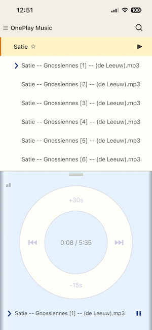
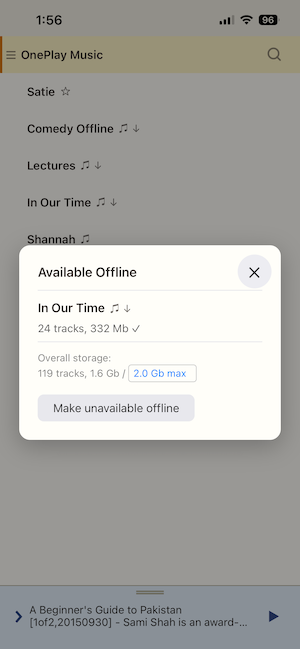
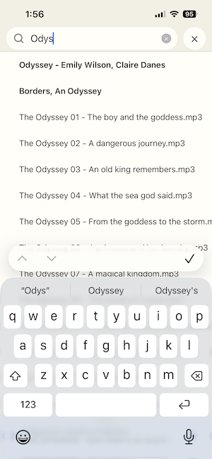
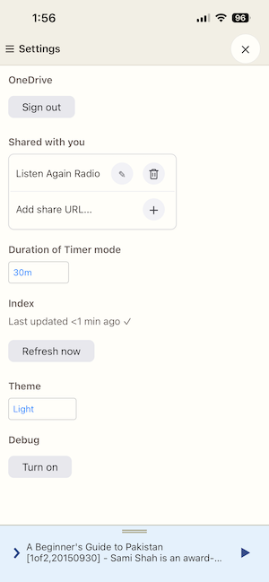
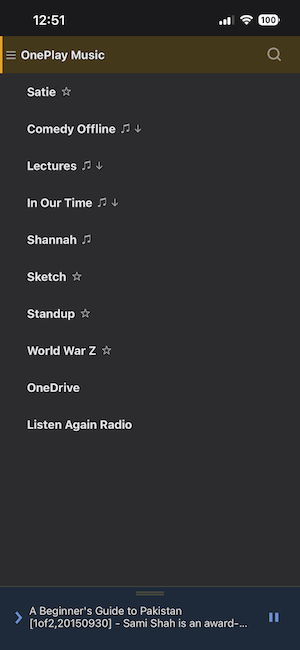

# OnePlay Music

OnePlay Music is a free offline-friendly music player for OneDrive.
1. Go to https://unto.me/oneplay/music/
2. Share it to your homescreen

Features:
- Free, and ad-free
- Shows and plays your OneDrive music, in your directory structure
- Supports favorites (playlists). You can make them available offline
- Friends can share their OneDrive music collections with you
- Search your tracks, folders, favorites
- Dark mode, and iPod-style scrollwheel!

 &nbsp;&nbsp;  &nbsp;&nbsp;  &nbsp;&nbsp;  &nbsp;&nbsp; 
